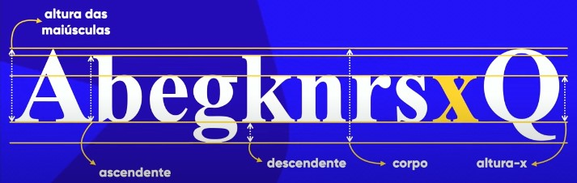
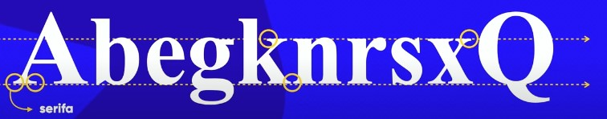
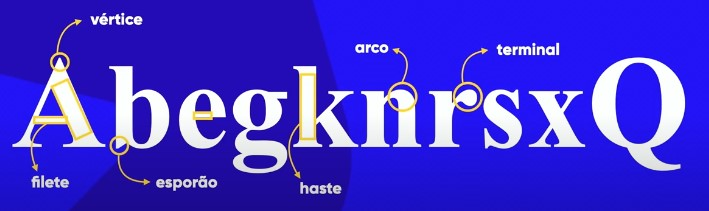
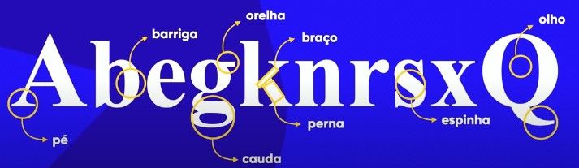
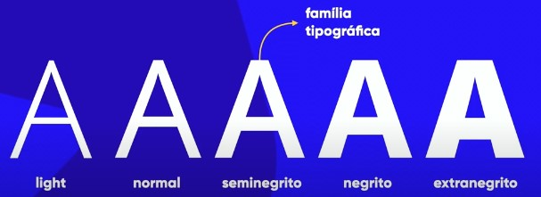
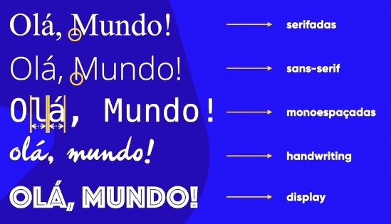
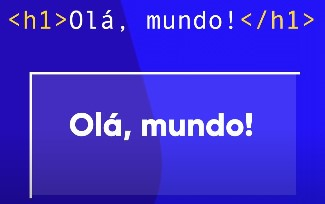
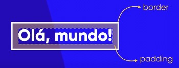
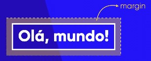
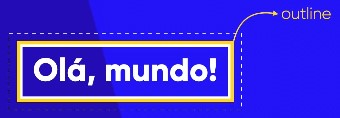

## Capítulo 13 - Conceitos de cores
------------------------------------------------
### Introdução - Aula 01
Apresentação dos tópicos que serão apresentados no Módulo 2 com apresentação do site exemplo que será desenvolvido.

------------------------------------------------
### Psicologia das Cores - Aula 02
#### A emoção das cores
ex: Amarelo representa a felicidade (mais detalhes no material pdf)
#### A importância das cores
 - A escolha de um produto está relacionada as cores que estão sendo utilizadas.
 - A psicologia das cores nos influencia, mas não sabemos ao certo quando e como isso acontece.
#### Para que as marcas usam o azul?
 - facebook, intel, hp, linkedin, twitter
 - Ligado a alguns conceitos como: Competência, confiança, sabedoria, calma, profissionalismo, integridade, segurança;
 - Nosso cérebro nem sempre percebe todos, mas acaba sempre percebendo alguns deles
 - **Estatisticamente**: É a cor mais aceita no mundo (46%) e com a menor taxa de rejeição (1%).
#### O uso do vermelho
Exemplos de utilização desta cor e momentos em que não é recomendado utilizar
 - Entetenimento, comida, amor, guerra
#### Cuidado como background preto
Background preto geralmente vem junto com uma cor de letra branca, que causa um cansaço visual.
 - Utilize fundo preto com letra branca, que gera um alto contraste, apenas quando seu site tiver poucas informações (texto) para serem exibidas.
 - No geral, vá no padrão que a chance de erro é muito menor. Tradicional fundo branco com letra preta.
#### Cores para comida
Vermelho e amarelo são uma boa combinação
 - **Vermelho**: Remete a comida
 - **Amarelo**: Remete a felicidade
 - Veja o logo do MacDonalds

A combinação de marrom e cinza também funcionam
 - Dão a impressão de um produto mais premium, refinado

Um exemplo com laranja com toques de cinza e verde (sim, BK)
 - **Laranja**: Divertimento, ambição, calor, cautela

#### O uso do verde
 - Conceitos de saúde, natureza, dinheiro, sorte e inveja
 - Relaxamento, turismo, financeiras, meio ambiente
 - Evite o uso do verde para luxo, tecnologia, meninas adolecentes

#### Projetos Monocromáticos
 - Utilização de vários tons da mesma cor
#### Cores e luxo
 - Amarelo, dourado, prata
#### Uso do Marron
 - Ideia de robustez, estabilidade, amizade
 - Uma cor um pouco delicada (minha opinião)
#### Casos modernos e bonitos
 - Ainda utilizando o azul, alguns vermelhos e também usando o roxo

------------------------------------------------
### Representando as cores com CSS - Aula 03 [exercício 16]
Como representar as cores nas CSS
 - Podemos adicionar as cores pelo seu nome (**white**), no formato hex (**#ffffff**) ou por código RGB (**rgb(255, 255, 255)**). Outra maneira é utilizando caracterpistica de cores (matiz/hil, Saturação/S, Luminosidade/L) (**hsl(0, 0%, 100%)**)
 - Cores em Hex representa quanto R, G e B tem naquela cor, sendo dois digitos para cada. Por exemplo o branco possui a maior intensidade de R, G e B (ff ou 255)
 - Para brincar com isso no VSC basta colocar qualquer cor e depois passar o mouse por cima dessa cor e escolher qual delas vai querer utilizar (sem necessáriamente saber de cabeça os códigos dessas cores em rgb, hsl ou hex).
 - Além disso, para escolher qual das representações aparecer no código, basta clicar em cima do código atual, que ele já altera entre as representações hex, hsl e rgb.
 - Também é possível adiconar, através da terceira barra de edição do VSC, a transparência. Isso vai adicionar dois digitos, em hex, ou mais um parâmetro ao rgba(alpha) e ao hsla(alpha), ao seu código de cor.

------------------------------------------------
### Harmonia de cores - Aula 04
#### Círculo cromático
 - Utilizado para harmonizar as cores
 - Provavelmente, quando você acha uma coisa bonita, mas não sabe dizer o por que, é por que foram utilizadas técnicas com o círculo cromático.
 - Umas das técnicas seria a simetria/sincronia, a outra é a cor
 ##### Cores primárias
  - Amarelo, vermelho e azul: aparecem de forma simétrica no círculo cromático formando um triângulo. Essas cores possuem uma harmonia grosseira.
 ##### Cores Secundárias
  - Laranja, violeta e verde: Uma harmonia de cores também grosseira.
 ##### Cores terceárias
  - Mistura de todas as outras cores primárias e secundárias.
  - Toda cor terceária está entre uma cor primária e uma cor secundária
  - Para me referir a cor terceária escrevo o nome da cor primária e depois da cor secundária.
  - Chamado de tons pastéis. As cores terceárias tem um tom pastel
 ##### Temperatura de cores
  - Dividindo o círculo cromático ao meio, temos de um lado as cores quentes e de outro lado as cores frias.
  - cada uma dessas paleta de cores são cores análogas e harmonizam entre si.

#### Escolhendo a paleta de cores para um site
 - Muito importante se preocupar com a criação da paleta de cores.
 - Sempre parte de uma cor principal - Qual a cor que mais condiz com a ideia que quero passar?
 - Uma paleta de cores tem em média de 3 a 5 cores (excluindo branco e preto dessa contagem que sempre estarão no seu site). Recomendado 4 cores (na média)
 - Qual a cor do logo do cliente? Para que eu possa escolher as demais cores.

#### Cores complementares
 - Cores que mais contrastam entre si. Para encontrar, basta pegar a cor oposta do círculo cromático.
 - Não necessáriamente são cores que ficam bonitas, vai depender do tom escolhido para a cor, mas são cores que possuem um bom contraste.

#### Cores análogas
 - Cores em que não possuem contrate tão grande entre si, mas são perceptíveis (fácil de diferenciar). Seriam as cores irmãs.
 - As cores ao lado, no círculo cromático, são as cores que mais vão harmonizar sem gerar grande contraste.
 - Criam uma espécie de um degradê.

#### Cores análogas e uma Complementar
 - Basta juntar os dois conceitos anteriores

 #### Cores análogas Relacionadas
 - Escolhe duas cores vizinhas, pula a terceira e pega a quarta cor.
 - Dessa maneira pego duas cores similares e uma que ainda é similiar, mas não tanto e que gera um certo contraste, mas não tão expressivo.

#### Cores Intercaladas
 - Parece com o tipo anterior (relacionadas) mas possuem um contraste um pouco maior.
 - pega cor 1, pula cor 2, pega cor 3, pula cor 4 e pega cor 5.
 - Paleta gerada é um pouco mais dura.
 - Existem 3 cores intercaladas que são famosas:
  ##### Cores triádicas
  - Escolho uma cor de referência, pulo 3 cores e pego a próxima cor.
  - Exemplo disso são as cores primárias e as secundárias
  ##### Cores em quadrado
  - Escolho uma e pulo duas e repito isso até ter as 4 cores que vão formar um quadrado.
  - Boa escolha quando quero escolher cores fortes e bem balanceadas
  ##### Cores tetrádicas
  - Escolho uma cor de referência e pego sua complementar. Escolho outra cor (qualquer) e pego seu complementar. Essas quatro vão formar um retângulo que irão compor a paleta de cores.
  ##### Monocromia
  - Trabalha com apenas 1 cor, alterando a saturação e a luminosidade dessa cor
  - A paleta formada é simétrica, homogênea, harmônica e baseada em monocromia (degradê).


------------------------------------------------
### Paleta de cores - Aula 05
#### Adobe Colors
 - color.adobe.com
 - Além do círculo cromático em que você consegue fazer todos os testes de cores feitas na aula anterior, também é possível enviar um logo e pegar a paleta de cores daquele logo. Também posso extrair o degrdê da imagem
 - Posso pegar paletas mais utilizadas
 - Tendências: Para buscar inspirações junto das paletas
#### Paletton
 - paletton.com
 - É possível verificar exemplo de aplicação da paleta de cores.
#### Colors
 - collors.co
 - Vai sugerindo uma paleta de cores a cada click

------------------------------------------------
### Como capturar cores da tela? - Aula 06
#### Forma "errada" de se fazer ( e por que)
 - Tirar um print da tela, jogar no editor de imagem pegar a cor com o conta-gota
 - No momento que tiro o print a tonalidade da cor já alterou um pouquinho.

#### Uma maneira de fazer isso ( de maneira mais confiável)
 - Extensão/plugin - ColorZilla
 - Fica um conta-gota já no navegador e consigo capturar a cor exata do site.

------------------------------------------------
### Como criar degradê com CSS? - Aula 07 [exercício 17]
Ao invés de utilizar a propriedade background-color, utilizar background-image (mesmo que seja para colocar uma cor e não uma imagem)
 - Esta propriedade vai disponibilizar uma função linear-gradient() em que você indica a direção e quantas cores quiser.
 - Para que seja aplicada na página toda, foi feita uma configuração global, para que o efeito seja aplicado igualmente na página toda.
```html
  <style>
      body {
          background-image: linear-gradient(to right, white, blue);
          /*ou*/
          background-image: linear-gradient(90deg, white 40%, blue);
      }
  </style>
```
 - Para alterar o quanto quer de cada uma das cores ocupando a tela, basta indicar qual a porcentagem que esta cor irá ocupar na tela.

------------------------------------------------
### Criando um exemplo real - Aula 08 [exercício 18]
#### Para criar arquivo CSS
 - Não esquecer de começar com ``@charset "UTF-8"`` para que entenda caracteres especiais.
 - Exemplo de aplicações de estilo:
```css
  main{
    background-color: #F2F2F2;
    width: 600px;
    padding: 10px;
    margin: auto;
    border-radius: 10px;
    box-shadow: 5px 5px 15px #a99571c1;
  }

  h1 {
    color: #EA42CB;
    text-align: center;
    text-shadow: 1px 1px 3px #6a1c5a4b;
  }
```
 - ``width``: Defini a largura do main
 - ``margin``: Colocando em auto, centraliza o main
 - ``box-shadow``: Os 5px são quanto a sombra vai para direita e baixo. 15px indica quão espaçado vai ficar a sombra. Por último a cor, em que peguei a mesma cor de fundo, diminuí a luminosidade (deixei mais perto do preto) e coloquei um pouco mais de transparência. Isso deu um efeito de estar um pouco mais escuro, como esperado, mas não tão duro, suavizando a sombra.

#### Sobre a tag \<main>
 - ``<main>`` pode ser entendido como uma ``<div>`` especial, que diz que se trata do conteúdo principal

#### Paleta de cores selecionada para este exercício
-  `#EA42CB`
-  `#F4B4D7`
-  `#F2F2F2`
-  `#ECD09B`
-  `#E2B152`

------------------------------------------------
## Capítulo 14 - Conceitos de fontes
------------------------------------------------
### Primeiros passos em Tipografia - Aula 01
#### História
 - O termo tipografia surgiu no século XV quando surgiu a imprensa
 - Antes disso existiam apenas Monges Copistas (Amanuênces - feito a mão)
 - Johannes Gutenberg criou a prensa mecânica de tipos móveis
 - Depois disso começou o estudo do tipos de letras que seriam mais cômodos para uma leitura. A partir daí, surge o <ins>ESTUDO DA TIPOGRAFIA</ins>, que se preocupava com a visualização e a legibilidade das letras.
 - TIPO: Vem de týpos, que significa impressão (colocar coisas no papel)
 - GRAFIA: Vem de graphía, que significa escrita
 - TIPOGRAFIA: Estudo de como escrever coisas no papel
 - Hoje em dia esse conceito evoluiu e estudamos a escrita tanto no papel quanto na tela.
 - A tipografia, juntamente com o estudo das cores e das imagens, são tópicos muito importantes do design, pois o conjunto traz emoções e sentimentos que refletem até mesmo inconscientemente.

------------------------------------------------
### Anatomia do tipo - Aula 02
Os elementos métricos estão presentes, de maneiras distintas, em todos os tipos de fontes. Já os elementos anatômicos não estarão presentes em todos os tipos de fontes.

#### Ítens métricos
 - A letra "x" é a letra base para a construção de todas as fontes.
 - Ao construir uma nova fonte, começam desenhando o "x" (minusculo) da fonte, pois existe uma métrica chamada 'altura x' que indica qual a altura do "x" (minúsculo) da fonte e esta irá definir qual a altura base de todas as letras minúsculas (ao menos a essência dessas letras estará dentro), exceto o vazamento de algumas letras minúsculas.
 - Existe também a altura das maiúsculas que pode, ou não, coincidir com a ascendente. Além disso também existe a descendente.
 - Juntando tudo, existe a altura total, chamada de corpo. Essa altura é imprtante saber, pois é ela que eu configura nas CSS.

<div align="center">
  
</div>

#### Ítens anatômicos
##### Ítens geométricos
 - O "pezinho" das letras é conhecido como serifa. Sua principal função seria ajudar a continuidade na leitura, como se a terminação de uma letra puxasse o início da próxima letra, o que ajuda na leiturabilidade/fluidez de um texto. Isso acontece pois as serifas formam duas linhas pontilhadas imaginárias (no topo e na base da altura x) que ajudam nosso cérebro a ler e entender o que está escrito sem ler letra por letra, mas sim o conjuto que forma a palavra.
<div align="center">
  
</div>

 - Estudos recentes mostram que, apesar da serifa surgir com esse intuito de facilitar a leiturabilidade, textos sem serifa são melhor para leitura de textos em tela.
 - Hastes:
 - Filete: Na horizontal e une duas hastes ou arcos
 - Arcos: 
 - Esporão: Cria a base da letra (um salto para manter a letra de pé)
 - Vértice:
 - Terminal: elemento que não está preso em outro lugar
<div align="center">
  
</div>

##### Ítens corporais
- Braços ou pernas: elemento que sai de uma haste e se eleva pra cima (braço) ou para baixo (perna)
- Pé: base que segura a fonte. Caso a fonte seja serifada, é no pé que se encontra a serifa
- Espinha: particular da letra "s" que possui uma curva para um lado e para o outro
- Barriga: Junção de dois arcos (exemplo letra "b")
- Olho: Espaço fechado por todos os lados
- Orelha:
- Cauda: Parte descendente que algumas letras possuem
<div align="center">
  
</div>

#### Outras nomenclaturas
 - Glifo: Umas das letras da fonte
<div align="center">
  
</div>

 - Uma fonte pode ter famílias 
 - Conjunto de glifos de uma determinada família formam uma FONTE
<div align="center">
  
</div>

 - Algumas fontes possuem mais de uma forma de representar o mesmo glifo, chamado de família tipográfica
<div align="center">
  
</div>

 - Ou seja, existem conjuntos de glifos para a mesma família. Lembrando que nem toda fonte tem uma família tipográfica.
 - CATEGORIA DE FONTE: serifada, sans-serif, monoespaçada, handwritng, display(não possui nenhuma das anteriores)
<div align="center">
  
</div>

------------------------------------------------
### Famílias de fonte com CSS - Aula 03 [exercício 19]
Ao escolher font-family para o texto, geralmente vem um conjunto de safe combination, ou seja, mais de um tipo de fonte. Isso garante que, caso o dispositivo não tenha o primeiro tipo de fonte, ele irá buscar alguma das outras que vem na sequência.
```css
  body {
            font-family: Arial, Helvetica, sans-serif;
        }
```
 - Neste caso tentará a fonte Arial primeiro, caso não encontre, ele utilizará a fonte Helvetica. Por último a san-serif.
 - Para encontrar quais são essas safe combinations, basta procurar "css web safe font combinations" (w3 schools). Ou ver as que o VSC sugere.
 - Uma alternativa seria colocar apenas "sans-serif", "serif", "monospace" ou outras genéricas, que vão retornar uma das fontes que se enquadram na categoria escolhida.
 - Sendo assim, sempre finalize a safe combination com uma categoria genérica

------------------------------------------------
### Tamanho de fonte e suas medidas - Aula 04 [exercício 19]
Seguindo as recomendações da W3C
 - Existem as medidas absolutas e as medidas relativas
 - MEDIDAS ABSOLUTAS: cm, mm, in(polegada), px, pt(ponto), pc(paica)
 - MEDIDAS RELATIVAS: em, ex, rem, vw, vh, %, ...
 - É recomendado o uso do px e do em

#### Medidas Absolutas
 - cm, mm e polegada: a visualização pode mudar de acordo com o tamanho da tela
 - px: depende da resolução da tela
 - pt e pc: medidas utilizadas na tipografia em papel então recomendadas para a tela

#### Medidas Relativas
 - em: relativo ao tamanho atual da fonte (em relação ao "M"(maiusculo) da fonte)
 - ex: relativo a altura x de uma fonte
 - rem: igual ao em, mas relativo a fonte utilizada no body (root)
 - vw (view width): relativo a largura da view port do aparelho
 - vh (view height): relativo a altura da view port do aparelho
 - % e ainda existem outras medidas relativas

```css
  body {
    font-size: 16px
  }
```
 - OBS: não colque espaço entre o número e a medida
 - Isso vai determinar o tamanho do CORPO da fonte
 - O tamanho padrão da fonte-size do parágrafo é 16px = 1em (geralmente)
 - CURIOSIDADE: o word utiliza o tamanho em pt
 - O em é o tamanho relativo ao tamanho natural da coisa
 - RECOMENDADO: Utilizar o em (no máximo px), pois posso trabalhar com a porcentagem da fonte padrão

------------------------------------------------
### Peso, estilo e shorthand font - Aula 05 [exercício 19]
#### Peso da fonte ou font-weight
 - Nem toda fonte possui, mas o peso da fonte pode ser lighter, normal, bold ou bolder
 - Outra alternativa, a invéz de utilizar as nomencleturas, seria utilizar a numeração de 100 a 900
```css
  body {
    font-weight: lighter; /*ou 100*/
  }
```
 - Não necessáriamente existem todos os pesos para todas as fontes e não necessariamente o 900 será o bolder e o lighter será o 100.

#### Estilo da fonte o font-style
 - Itálico (italic) ou normal (normal)
 - Dessa maneira é possível combinar o peso e o estilo da fonte
 - Nem todas as fontes possuem todas essas possibilidades de combinar parâmetros de estilo e peso
```css
  body {
    font-style: italic;
    text-decoration: underline;
  }
```
 - Para inserir o underline também é necessário verificar se a fonte escolhida possui todas as variações.

#### Shorthand ou uma mãozinha
 - Ao invés de ficar escrevendo várias vezes as mesmas configurações de fonte apresentadas para cada tag, o shorthand vai condensar todas essas configurações.

```css
  body {
      font-family: Arial, Helvetica, sans-serif;
      font-size: 16px;
      font-weight: lighter;
      font-style: italic;
  }
  
  h1 {
      /* shorthand font
      - font-style -> font-weight -> font-size -> font-family */
      font: normal bold 3em Arial, sans-serif;
  }
```

------------------------------------------------
### Usando o Google Fonts - Aula 06 [exercício 20]
 - fonts.google.com
 - Para escolher uma fonte posso escolher por categorias
 - copio o código CSS disponibilizado para meu código para que saiba onde procurar a fonte (no Google Fonts)
 - Select this style > @import > copiar e colar o código
 - Posso selecionar vários estilos de uma mesma fonte, caso ela possua mais de um estilo.
```css
  @import url('https://fonts.googleapis.com/css2?family=Work+Sans:ital,wght@0,100;0,200;0,300;0,400;0,500;0,600;0,700;0,800;0,900;1,100;1,200;1,300;1,400;1,500;1,600;1,700;1,800&display=swap');
  body {
    font-family: 'Work Sans', sans-serif;
    font-size: 16px;
    color: black;
  }
```
 - Lembrando que tudo o que vem com @ é importado e deve estar contido nas primeiras linhas do arquivo css ou dentro da tag style.
 - Além disso essas regras (os imports) devem estar fora de seletores (body, h1, h2) que devem conter apenas propriedades e valores.

------------------------------------------------
### Usando de fontes externas baixadas - Aula 07 [exercício 20]
Outro exemplo de site que possui fonte é o dafont.com
 - PONTO IMPORTANTE: Procurar por fontes que possuam glifos acentuados (pelo menos se for escrever em português)
 - Posso colocar mais de um tipo/arquivo de fonte separando por ',' ou colocar apenas uma. Alguns navegadores podem não ser compatíveis com alguns formatos.
```css
  @font-face {
    font-family: ;
    src: url('fonts/love larry.otf') format('opentype'), url('fonts/love larry.ttf') format('truetype');
  }
  body {
    font-family: 'Work Sans', sans-serif;
    font-size: 16px;
    color: black;
  }
```
#### Tipos de format()
 - opentype (otf)
 - truetype (ttf)
 - embedded-opentype
 - turetype-aat (Apple Advenced Typography)
 - svg

<ins>GUARDE SUAS FONTES NUMA PASTA, NÃO AS DEIXE ESPALHADAS</ins>

------------------------------------------------
### Capturando as fontes usadas em um site - Aula 08 [exercício 20]
 - font2.html
 - extensão para o google chrome: Fonts Ninja
 - Através do inspetor do navegador também é possível verificar.
 - Depois posso procurar essa fonte no google fons ou no dafonts.

------------------------------------------------
### Detectando fontes dentro de imagens - Aula 09
 - Sites:
  - whatfontis.com;
  - fontsquirrel.com;
  - myfonts.com.

 - What font is é o que possui maior nível de inteligência.

------------------------------------------------
### Alinhamento de textos com CSS - Aula 10 [exercício 20]
 - font3.html
 - Antigamente existia uma tag /<center/> porém não se usa mais.
 - o alinhamento de ve ser feito no estilo.
 - Tendo uma configuração para o body e depois uma para h1, ele seguirá a última que foi configurada, considerando que o documento de estilo será lido do início para o fim.
```css
p {
  text-align: justify;
  text-indent: 20px;
}
```
 - text-indent irá indentar o início do texto

------------------------------------------------
## Capítulo 15 - Seletores personalizados
------------------------------------------------
### Usando o id com CSS - Aula 01 [exercício 21]
 - seletor01.html
#### Em que momento terei que utilizar seletores personalizados?
 - Quando tenho dois elementos da mesma classe em html e quero formatações diferentes para cada um deles.

#### Como fazer essas configurações?
 - Identifico as tags e coloco o estilo dela abaixo do que seria o estilo padrão (no caso do h1)
```html
<h1 id="principal">meu texto</h1>
```
```css
h1 {
  text-align: justify;
  text-indent: 20px;
}

h1#principal {
  text-align: center;
}
```
 - Mas também posso colocar diretamente #principal sem o h1 na frente, dessa maneira, todos que tiverem esse identificador na tag seguirão este padrão
 - E este é um seletor personalizado (#principal)
```css
h1 {
  text-align: justify;
  text-indent: 20px;
}

#principal {
  text-align: center;
}
```
 - OBS: Correspondências entre HTML e CSS
  - HTML é id = CSS é #
  - HTML é class = CSS é .

------------------------------------------------
### As diferenças entre id e class - Aula 02 [exercício 21]
 - seletor01.html
#### Qual a diferença entre id e class? Pra que existe os dois?
 - id é único e classe pode ser multiplos
 - Dentro de um mesmo documento html só se pode ter 1 elemento com id. É errado colocar o mesmo id em todos os elementos.
 - É possível colocar id="principal" em mais de uma tag (sejam elas iguais ou diferentes) e vai funcionar normalmente. Porém é incorreto de acordo com as regras da W3C
 - Quando quero aplicar a mesma configuração em mais de uma tag eu utilizo class="basico"
 - DICA PARA NOMEAR: Não dê o nome às classes e ids de acordo com a forma, mas sim de acordo com o significado, de acordo com a funcionalidade.

```css
h2 {
    color: #5064E1;
}

.basico {
    color: yellowgreen;
}

.intermediario {
    color: yellow;
}

.avancado {
    color: red;
}
```
 - E eu posso aplicar essas configurações da classe no meio do texto se eu quiser
 - Além disso também posso utilizar mais de uma classe num mesmo trecho, separando os nomes das classes por um espaço.
```html
<h1 class="avancado destaque">meu texto</h1>
```
 - Além disso também posso colocar um id junto de uma classe. Lembrando que o id sobrepõe as configurações de classe.
```html
<h1 id="principal" class="avancado">meu texto</h1>
```

------------------------------------------------
### Pseudo-classes em CSS - Aula 03 [exercício 22]
 - pseudo-clesse.html
#### \<div\>
 - Espaço que preenche a largura da página caso não seja configurada uma largura. A altura também.

#### Pseudo-classes
 - indicadas por ":"
 - Pseudo-classes devem estar relacionadas a um elemento ou a uma classe.
```css
div {
    display: inline-block;
    background-color: blueviolet;
    text-align: center;
    height: 200px;
    width: 200px;
    border: 1px solid black;
}

div:hover {
    background-color: yellow;
}
```

 - hover.html
 - Também é possível referênciar elementos internos de uma div
```css
body {
    font-family: Arial, Helvetica, sans-serif;
}

div > p {
    display: none;
}

div:hover > p {
    display: block;
    width: 200px;
    background-color: salmon;
    color: springgreen;
}

div:hover {
    width: 200px;
    color: red;
}
```
 - div > p indica que quero modificar o estilo do parágrafo está dentro da div.

------------------------------------------------
### Pseudo-elementos em CSS - Aula 04 [exercício 22]
 - pseudo-elementos.html
 - text-decoration: none; tira o sublinhado de um link
 - (pseudo classe) a:active - enquanto está clicado
 - Outras duas pseudo-classes: active e visited
```css
body {
    font-family: Arial, Helvetica, sans-serif;
}

a {
    color: red;
    text-decoration: none;
    font-weight: bold;
}

a:visited {
    color: rgb(35, 172, 23);
}

a:hover {
    text-decoration: underline;
    color: black;
}

a:active {
    color: yellow;
}
```

 - Pseudo-classes: palavras que definem estados de elementos dentro da HTML. (:)
 - Pseudo-elemento: Pode agira nas classes, elementos, ids,... Eles mexem diretamente no conteúdo periférico do elemento. (::)

```css
body {
  font-family: Arial, Helvetica, sans-serif;
}

a {
  color: red;
  text-decoration: none;
  font-weight: bold;
}

a::after {
  content: ' [link]';
  text-decoration: none;
  font-weight: normal;
  color: black;
}
```

 - https://erikasarti.com/html/dingbats-simbolos-desenhos/
 - Site com tabela de símbolos especiais (e outros) em HTML
 - Aplicando classes e modificando-as em CSS. E modificando as classes por meio de pseudo-elementos.
 - RESUMO de algumas simbologias das CSS de seletores personalizados
  - \# = id
  - . = class
  - : = pseudo-class
  - :: = pseudo-element
  - \>  = children

------------------------------------------------
## Capítulo 16 - Modelos de Caixas
------------------------------------------------
### Primeiros passos - Aula 01

Modelos de caixas, ou box model é a teoria sobre o boz sizing e a forma como os boxes são exibidos.

Aplicável ao HTML5 e CSS3 que facilta muito a organização do design e as partes do seu site.

#### Paradigma
 - Pensar que tudo o que está sendo exibido na página está no modelo de caixas.
 - É possível ter caixas, uma dentro da outra, o que vai facilitar ainda mais a organização do site. Isso forma uma hierarquia entre os elementos.
 - A organização de uma caixa dentro da outra se dá o nome de aninhamento.

##### Exemplo
 - o h1 é um elemento de caixa

<div align="center">
  
</div>

 - todo elemento visivel dentr da tela e um site é uma caixa (em pontilhado). No momento em que eu escolho h1, eu já estou configurando a caixa que sera utilizada

<div align="center">
  
</div>

##### Termos e dimensões da caixa
A parte do conteúdo é delimitada pela parte pontilhada.
 - Altura (height)
 - Largura (width)

<div align="center">
  
</div>

 - Também posso traçar uma linha ao redor da caixa pontilhada, chamada de borda, ou border, que circunda o seu conteúdo. Ela fica bem próxima do pontilhado. (dentro do elemento)
 - Mas também posso dar uma folga entre o conteúdo e a borda. Este seria o padding (acolchoamento ou preenchimento) isso dá uma distância entre a borda e o conteúdo. O padding pode ser aplicado apenas de um lado, dos dois laods, em cima, em baixo ou em todos os lados uniformemente.

<div align="center">
  
</div>

 - Margin - espaçamento externo para que, quando eu acrescentar uma nova caixa, esta não fique grudada na borda do meu elemento.

<div align="center">
  
</div>

 - Outline - Contorno ou traçado é a linha ao redor da borda (fora do elemento)

<div align="center">
  
</div>
