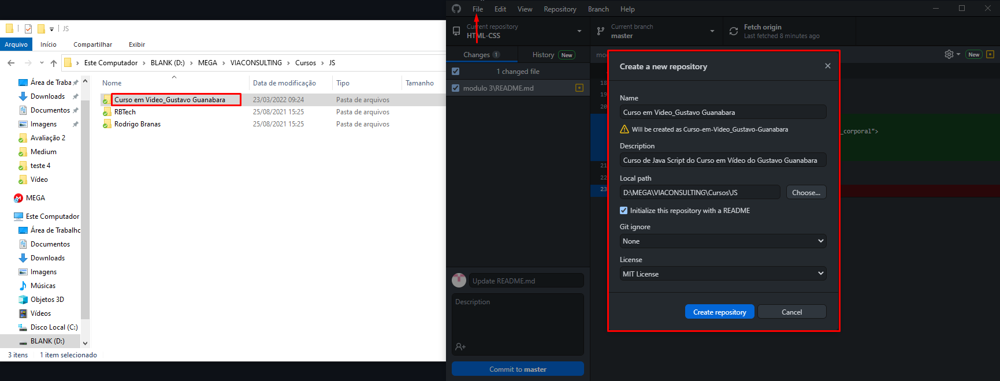
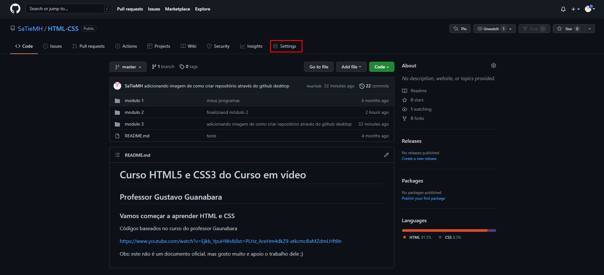
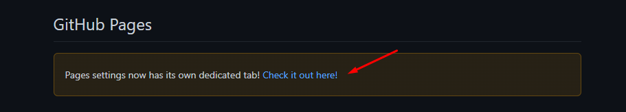
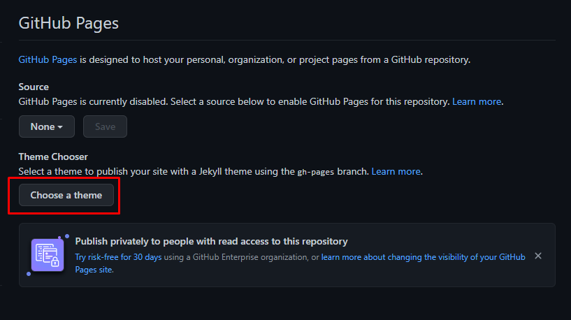
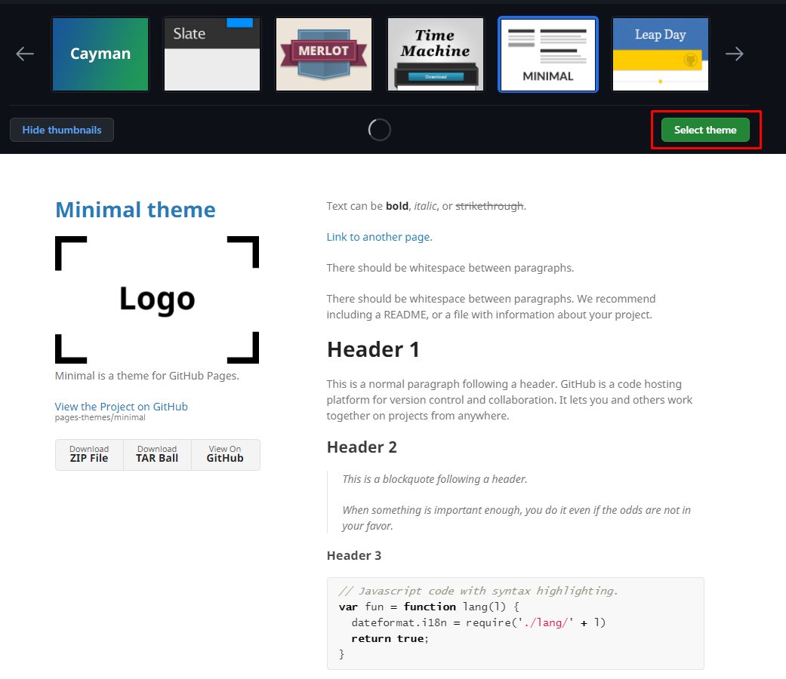
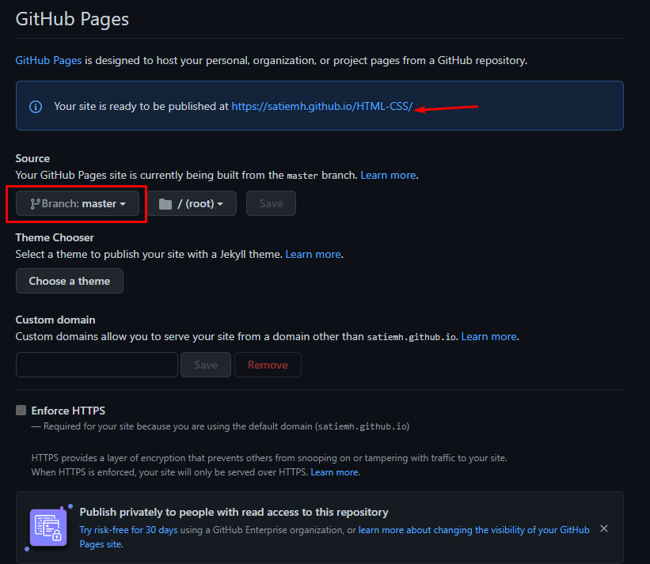
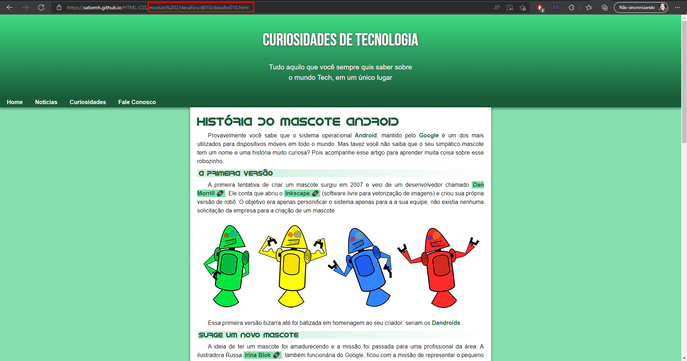
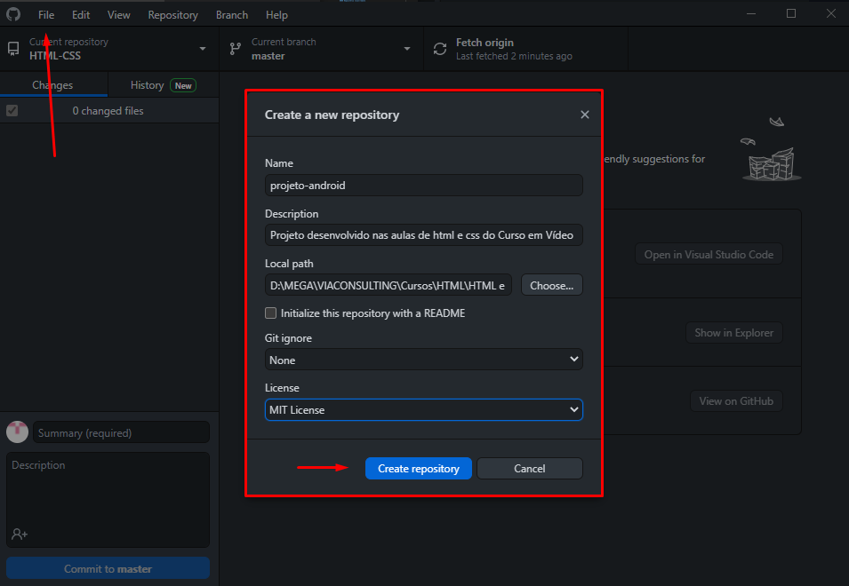

## Capítulo 18 - Versionamento de software
------------------------------------------------
### O que é Git e Github? - Aula 01
#### Repositório local/remoto
- O ideal é sempre guardar versões do seu projeto
- Posso utilizar um gerenciador de versões (resolvo problema de sobrescrever o código)
- coloco o código na nuvem (resolvo o problema de compartilhamento e de perda de dados na máquina local)

- Repositório local: git
- repositório remoto: GitHub

------------------------------------------------
### Instalando git e GitHub no PC - Aula 02

------------------------------------------------
### Criando conta no GitHub - Aula 03

------------------------------------------------
### Primeiro repositório git e GitHub - Aula 04

  

------------------------------------------------
### Gerenciando Repositórios GitHub - Aula 05

------------------------------------------------
### Hospedando site gratuitamente com GitHub Pages - Aula 06

#### Passo-a-passo de como criar o GitHub Pages.

  <ol>
    <li>
    Vá em "Settings" 
    
    </li>
       
    <li>
    Encontre GitHub pages e clique no ícone 
    
    </li>
       
    <li>
    Escolha um tema 
    
    </li>
       
    <li>
    Após escolhido um tema confirme a seleção 
    
    </li>
       
    <li>
    Não esqueça de alterar a branch que será puxada, no caso a master. mas pode salvar a nova branch que é criada por padrão (gh-page) e só depois alterar 
    
    </li>
       
    <li>
    Depois de uns minutinhos (demora um pouqinho pra atualizar) o link vai abrir o arquivo README.md do repositório. Para conseguir abrir outro arquivo, basta indicar o caminho das pastas na url. 
    
    </li>
  </ol> 

   

#### Colocando o projeto feito no GitHub pages
- Vamos fazer isso aparecendo uma url mais bonitinha e fácil de ser acessada pelas pessoas.

  <ol>
    <li>
    Para começar você deve criar um novo repositório dedicado para a página, para que não seja necessário entrar em diversas páginas para conseguir chegar até o projeto.  LEMBRANDO: Neste caso descelecione a opção de criar um arquivo README.md no momento da criação do repositório. 
    
    </li>
       
    <li>
    Copie os arquivos do projeto na pasta do repositório. 
    
    </li>
       
    <li>
    Altere o nome do arquivo .html para index, pois assim o navegador já vai entender que se trata de um site e já vai puxar este documento e abrir o site. 
    
    </li>    
  </ol> 

   