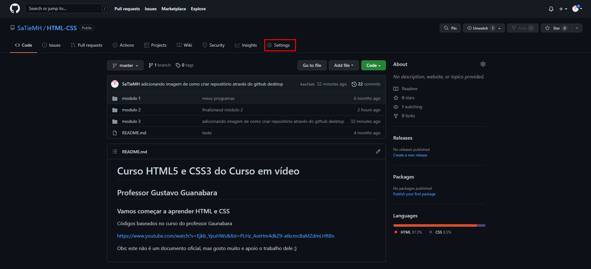
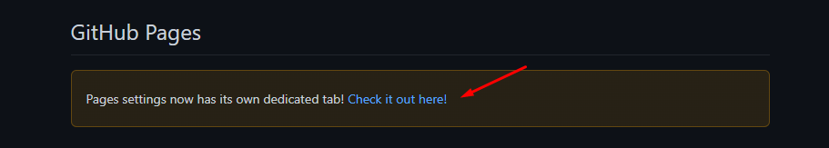
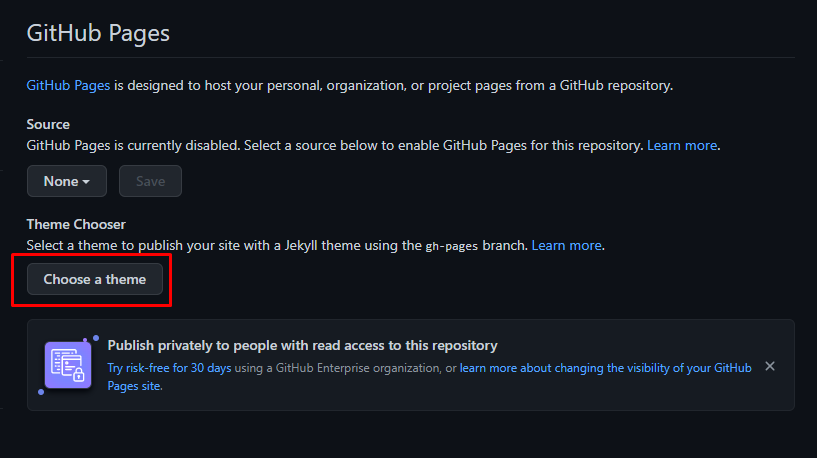
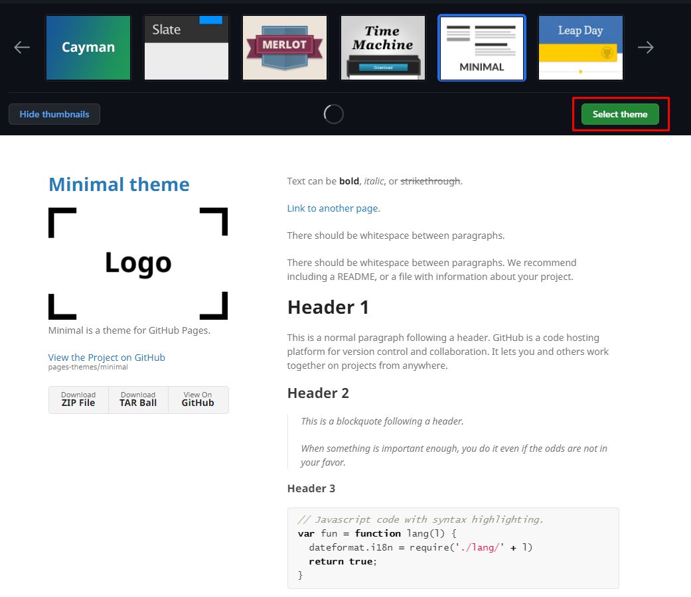
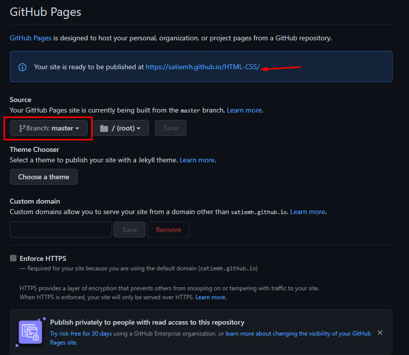
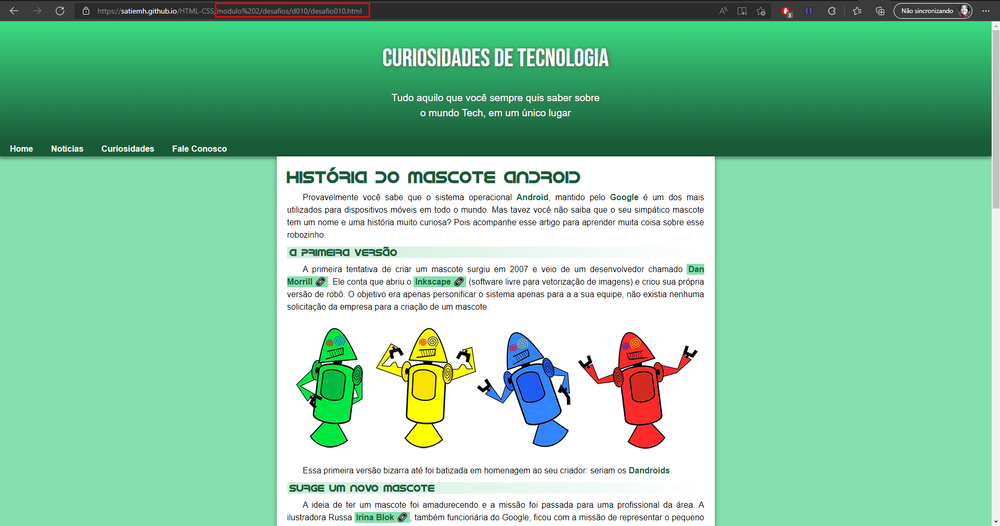

## Capítulo 18 - Versionamento de software
------------------------------------------------
### O que é Git e Github? - Aula 01
#### Repositório local/remoto
- O ideal é sempre guardar versões do seu projeto
- Posso utilizar um gerenciador de versões (resolvo problema de sobrescrever o código)
- coloco o código na nuvem (resolvo o problema de compartilhamento e de perda de dados na máquina local)

- Repositório local: git
- repositório remoto: GitHub

------------------------------------------------
### Instalando git e GitHub no PC - Aula 02

------------------------------------------------
### Criando conta no GitHub - Aula 03

------------------------------------------------
### Primeiro repositório git e GitHub - Aula 04

  

------------------------------------------------
### Gerenciando Repositórios GitHub - Aula 05

------------------------------------------------
### Hospedando site gratuitamente com GitHub Pages - Aula 06

  
  
  
  
  
  

