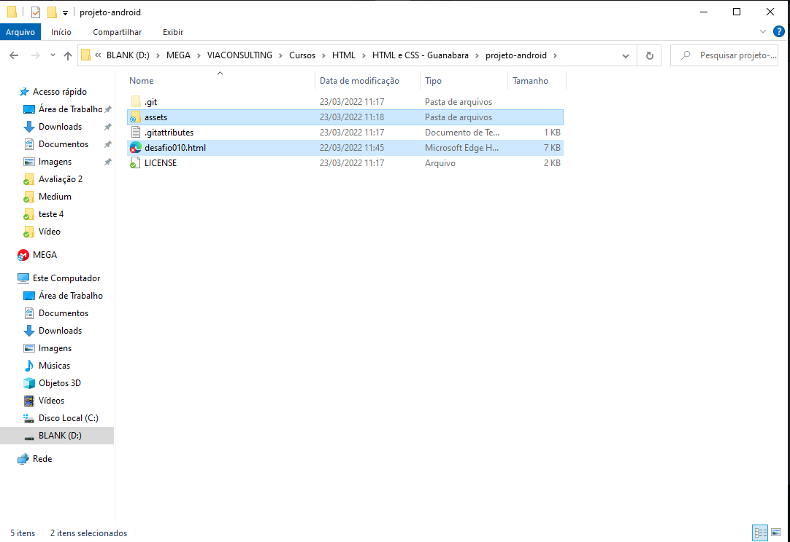
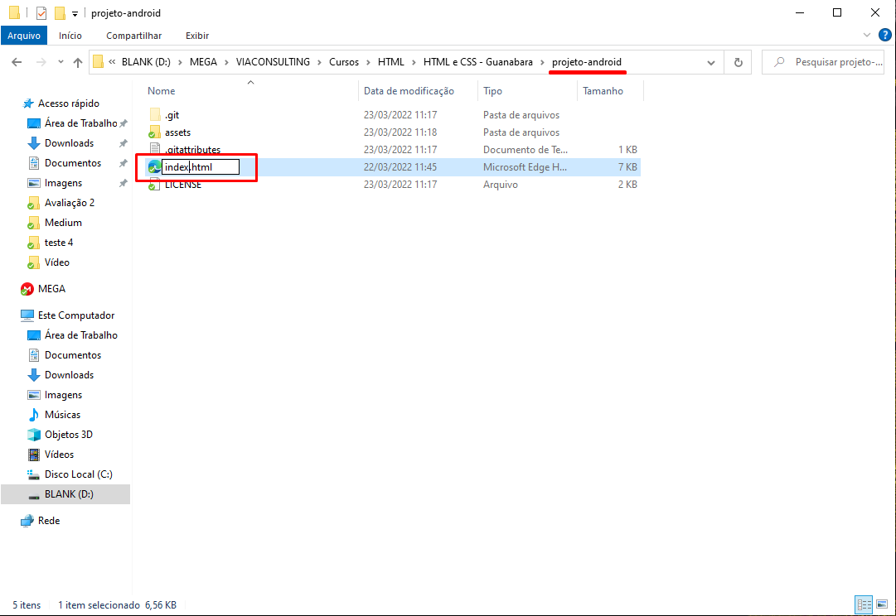
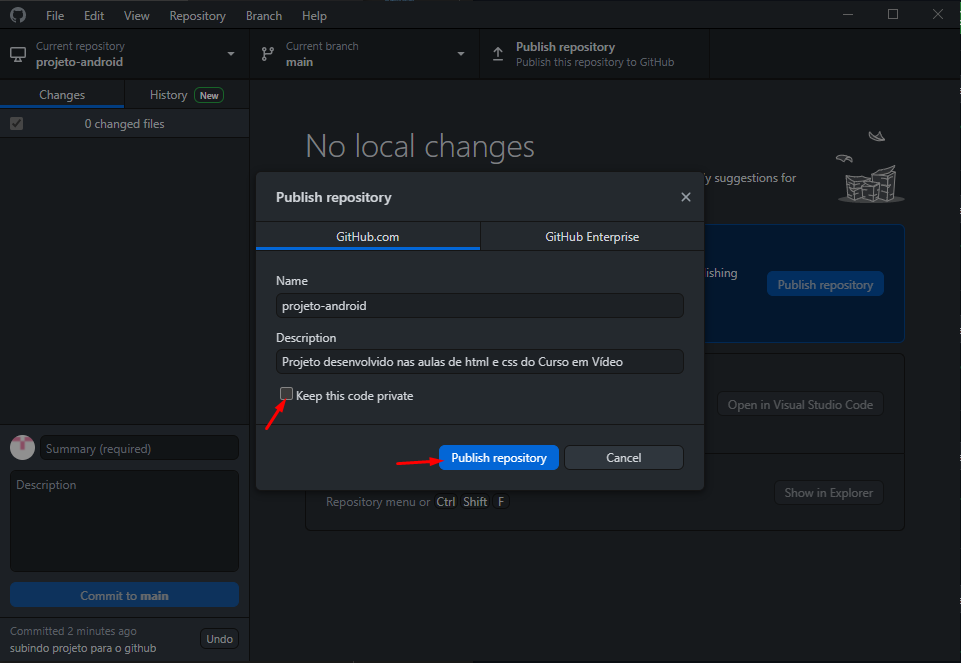
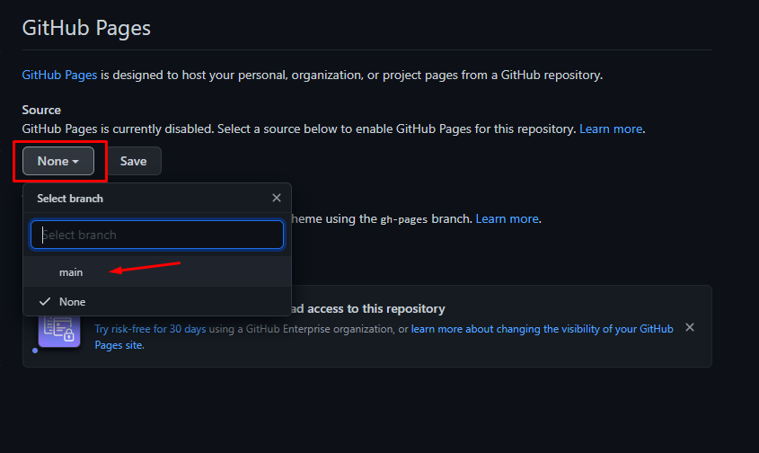

## Capítulo 18 - Versionamento de software
------------------------------------------------
### O que é Git e Github? - Aula 01
#### Repositório local/remoto
- O ideal é sempre guardar versões do seu projeto
- Posso utilizar um gerenciador de versões (resolvo problema de sobrescrever o código)
- coloco o código na nuvem (resolvo o problema de compartilhamento e de perda de dados na máquina local)

- Repositório local: git
- repositório remoto: GitHub

------------------------------------------------
### Instalando git e GitHub no PC - Aula 02

------------------------------------------------
### Criando conta no GitHub - Aula 03

------------------------------------------------
### Primeiro repositório git e GitHub - Aula 04

<div align="center">
  
</div>

------------------------------------------------
### Gerenciando Repositórios GitHub - Aula 05

------------------------------------------------
### Hospedando site gratuitamente com GitHub Pages - Aula 06

#### Passo-a-passo de como criar o GitHub Pages.

<div>
  <ol>
    <li>
    Vá em "Settings"</br>
    
    </li>
    </br></br></br>
    <li>
    Encontre GitHub pages e clique no ícone</br>
    
    </li>
    </br></br></br>
    <li>
    Escolha um tema</br>
    
    </li>
    </br></br></br>
    <li>
    Após escolhido um tema confirme a seleção</br>
    
    </li>
    </br></br></br>
    <li>
    Não esqueça de alterar a branch que será puxada, no caso a master. mas pode salvar a nova branch que é criada por padrão (gh-page) e só depois alterar</br>
    
    </li>
    </br></br></br>
    <li>
    Depois de uns minutinhos (demora um pouqinho pra atualizar) o link vai abrir o arquivo README.md do repositório. Para conseguir abrir outro arquivo, basta indicar o caminho das pastas na url.</br>
    
    </li>
  </ol> 
</div>
</br></br></br>

#### Colocando o projeto feito no GitHub pages
- Vamos fazer isso aparecendo uma url mais bonitinha e fácil de ser acessada pelas pessoas.

<div>
  <ol>
    <li>
    Para começar você deve criar um novo repositório dedicado para a página, para que não seja necessário entrar em diversas páginas para conseguir chegar até o projeto. </br>LEMBRANDO: Neste caso descelecione a opção de criar um arquivo README.md no momento da criação do repositório.</br>
    
    </li>
    </br></br></br>
    <li>
    Copie os arquivos do projeto na pasta do repositório.</br>
    
    </li>
    </br></br></br>
    <li>
    Altere o nome do arquivo .html para index, pois assim o navegador já vai entender que se trata de um site e já vai puxar este documento e abrir o site.</br>
    
    </li> 
    </br></br></br>
    <li>
    No momento em que ele for criar um repositório no GitHub certifique-se de que o mesmo não está subindo como um repositório privado. Caso contrário não estará disponível para as pessoas visualizarem.</br>
    
    </li> 
    </br></br></br>
    <li>
    Repita os passos de como criar um github pages para este repositório. Pois lembrando que ao fazer isso, a criação do githubpages passa a valer apenas para o repositório selecionado. Como foi criado um novo é necessário repetir os passos.</br>
    A única difenrença será que, ao invés de escolher um tema pode alterar a branch selecionada (neste caso 'main')</br>
    
    </li>    
  </ol> 
</div>
</br>

------------------------------------------------
### Manutenção em sites hospedados no GitHub Pages - Aula 07

------------------------------------------------
### Recursos Sociais do GitHub - Aula 08

------------------------------------------------
### Clonando Repositórios GitHub - Aula 09

------------------------------------------------
### GitHub em vários PCs - Aula 10

- É necessário ter instalado o git e o GitHub desktop no pc que você faráo clone.


## Capítulo 19 - Imagens de fundo
------------------------------------------------
### Download das imagens do capítulo - Aula 01
- ex_024 > imagens

------------------------------------------------
### Colocando uma imagem de fundo no seu site - Aula 02
- ex_024 > fundo001.html
- Aplicando background-image
```css
  background-image: url(imagens-cap19/wallpaper001.jpg);
```
- Por default a imagem vai se repetir

------------------------------------------------
### Imagens que se repetem no fundo do site - Aula 03
- ex_024 > fundo002.html

- Aplicando algumas propriedades no background-image
```css
  background-image: url(imagens-cap19/wallpaper001.jpg);
  background-size: 100px 100px;
  background-repeat: no-repeat;
```

- Também posso fazer repetir apenas no eixo x ou no eixo y
```css
  background-image: url(imagens-cap19/wallpaper001.jpg);
  background-size: 100px 100px;
  background-repeat: repeat-x; //ou repeat-y
```
- Lembrando que sempre vai começar a repetir a partir do canto superior esquerdo. Posso alterar isso também.

- Também posso alterar a imagem para uma imagem da internet
```css
  background-image: url(https://i.pinimg.com/736x/23/c2/df/23c2df2507e29e38853b5c8ddd6f62a0.jpg);
```

------------------------------------------------
### Configurando a posição da imagem no fundo do site - Aula 04
- ex_024 > fundo003.html

- Brincando com a posição da imagem de fundo para entender melhor do que se trata com background-position
- A posição indicada no background-position será a posição na qual a imagem se manterá ancorada, ou seja, independente do tamanho da janela do navegador, a imgem começará a ser exibida a partir daquele ponto.

- ex_024 > fundo004.html
- ex_024 > fundo005.html

------------------------------------------------
### Mudando o tamanho do tamanho da imagem de fundo do site - Aula 05
- ex_024 > fundo006.html

- background-size: contain; - resultado semelhante ao 100%
- background-size: cover; - Cobre a tela inteira, mesmo que tenha que picotar a imagem.
- LEMBRANDO: deve ser colocado height: 100vh;

------------------------------------------------
### background-attachment e shorthand - Aula 06
- ex_024 > fundo006.html

- Fixar o fundo da tela com background-attachment
 - scroll: faz com que o fundo role junto
 - fixed: faz com que o fundofique fixo e não role junto com a tela

- OU SEJA: Juntando o background-size: cover e background-attachment: fixed consigo deixar a imagem ajustada ao tamanho da tela e fixa durante a rolagem.

#### Shorthand background
- color
- image
- position
- repeat
- [size]
- attachment

- sem shorthand
```css
  height: 100vh;
  background-color: black;
  background-image: url(imagens-cap19/wallpaper002.jpg);
  background-position: center center;
  background-repeat: no-repeat;
  background-size: cover;
  background-attachment: fixed;
```

- com shorthand
```css
  height: 100vh;

  background: black url(imagens-cap19/wallpaper002.jpg) center center no-repeat fixed;

  background-size: cover;
```

- Apenas o background-size (aparentemente ainda) não é compatível com todos os navegadores. Por conta disso ele deve ficar de fora do shorthand.

------------------------------------------------
### Centralização vertical de caixas - Aula 07
- ex_024 > fundo007.html

- Utilizamos margin: auto para centralizar o conteúdo horizontalmente, mas <strong>como fazer para alinhar o conteúdo verticalmente?</strong>
- Para resolver esse problema é preciso utilizar o posicionamento relativo, ou seja, a caixa externa terá um posicionamento relativo (não é necessário declarar essa parte por que já é padrão, todo elemento no html tem posicionamento relativo)
- Além disso é importante que o conteúdo interno seja posicionado de maneira absoluta

- PROBLEMA: Quando uso posicionamento absoluto eu acabo considerando o canto superior esquerdo do elemento e não seu centro.
- RESOLVENDO: Para resolver isso eu posso usar uma transformação nas caixas (transform). Neste caso vou usar a função (translate())


## Capítulo 20 - Projeto Completo
------------------------------------------------
### Um projeto completo usando HTML e CSS - Aula 01
- desafio 12 - Cordel Moderno

------------------------------------------------
### Download e organização dos arquivos - Aula 02
- desafio 12 - Cordel Moderno
- Baixando arquivos

------------------------------------------------
### Ajustes no HTML do projeto - Aula 03
- desafio 12 - Cordel Moderno
- Montando o arquivo html

------------------------------------------------
### Ajustes no CSS do projeto - Aula 04
- desafio 12 - Cordel Moderno
- Montando o arquivo css

- Para funcionar melhor o efeito parallax independente do tamamanho da tela é importante colocar os espaçamentos entre os trechos, e para isso utilizar a view port (neste caso com 10% do tamanho).
```css
  padding-top: 10vh;
  padding-bottom: 10vh;
```

------------------------------------------------
### Colocando as fontes ao projeto - Aula 05
- desafio 12 - Cordel Moderno

------------------------------------------------
### Imagens com efeito Parallax - Aula 06
- desafio 12 - Cordel Moderno

